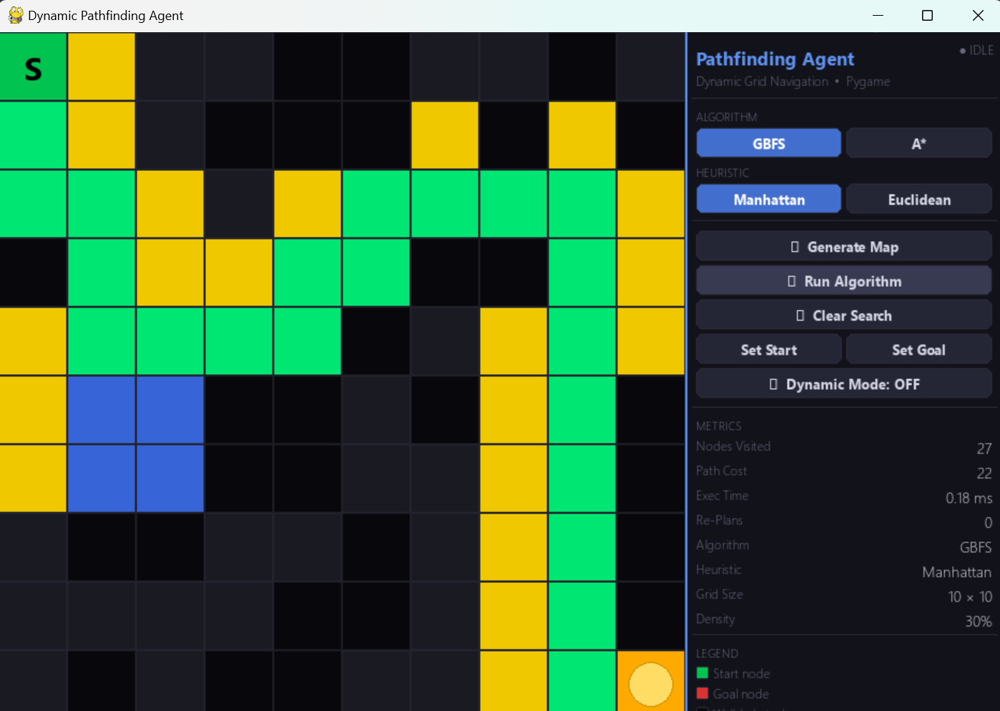
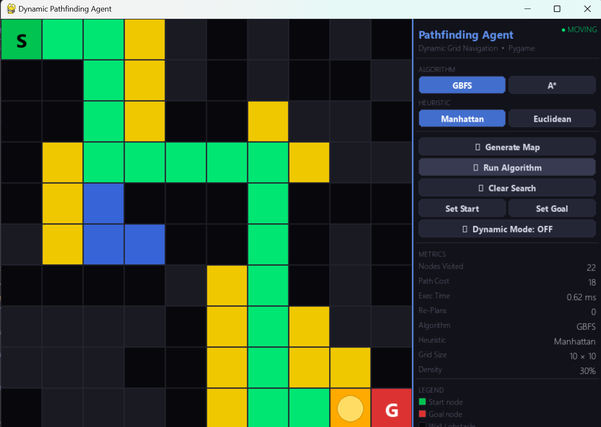
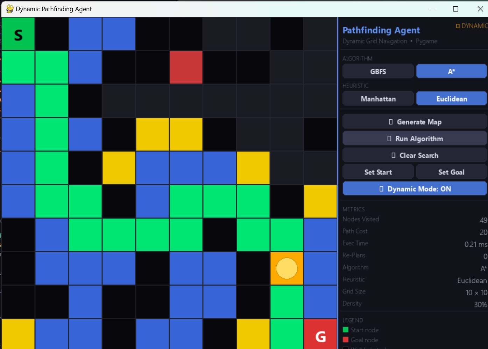
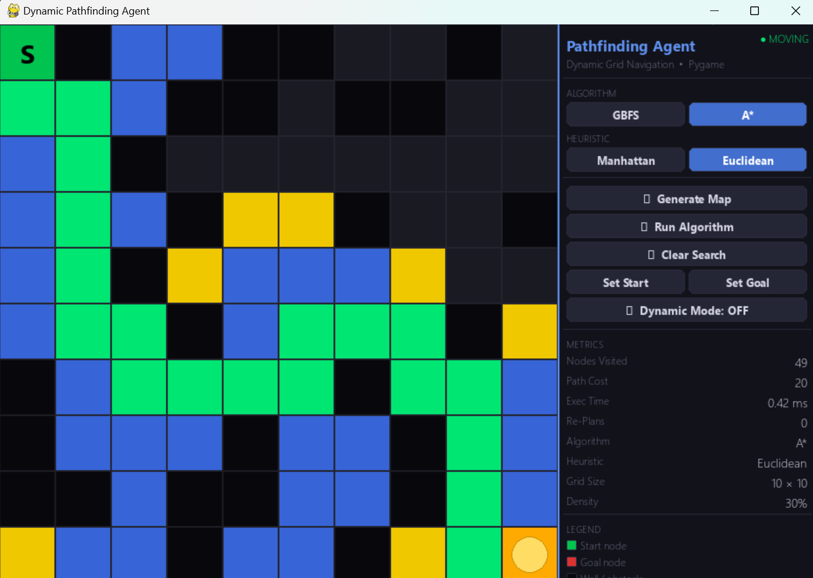
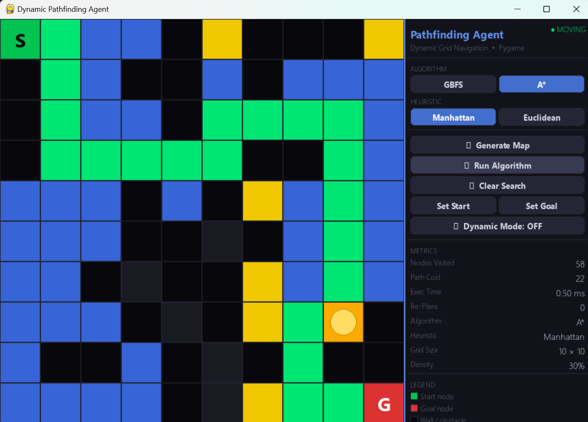
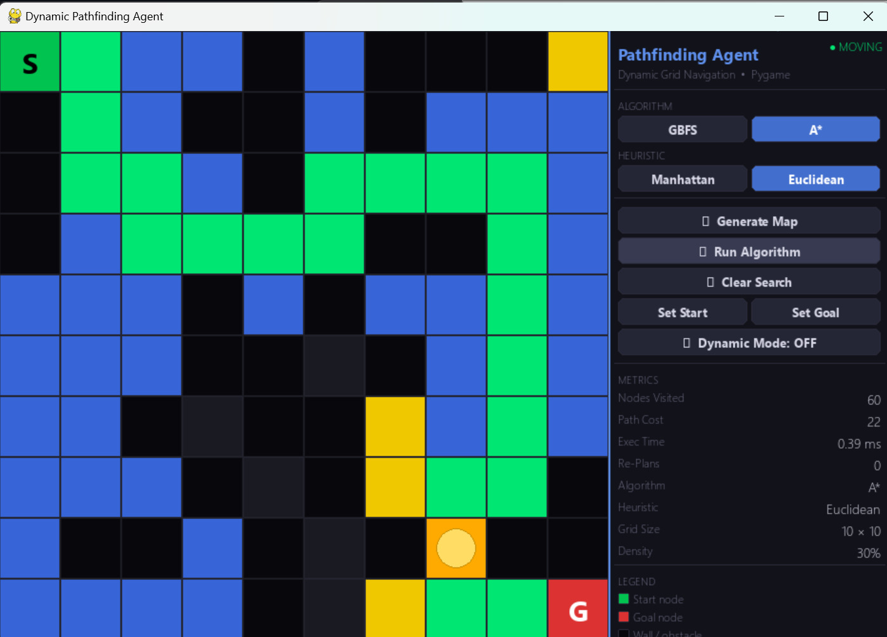
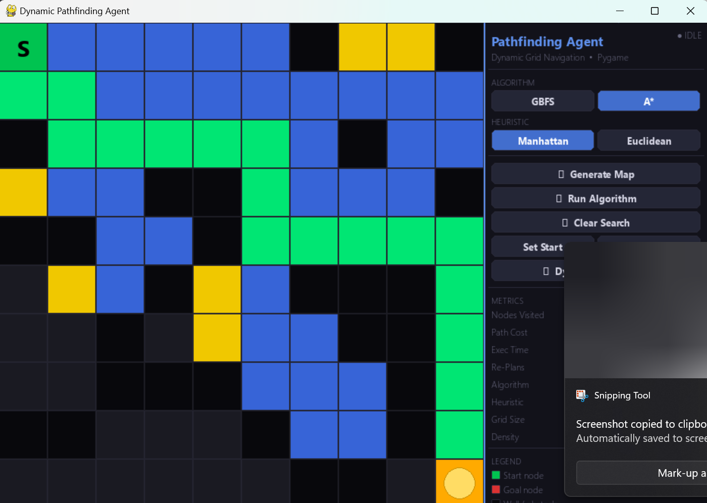

# Dynamic Pathfinding Agent 

A real-time, Pygame-based AI pathfinding visualiser that implements **GBFS** and **A\*** search with dynamic obstacle re-planning.

---

## Features

| Feature | Details |
|---------|---------|
| **Grid** | User-defined size (5–60 rows × cols) |
| **Algorithms** | Greedy Best-First Search (GBFS) · A\* |
| **Heuristics** | Manhattan distance · Euclidean distance |
| **Interactive Editor** | Left-click to place walls, right-click to remove |
| **Random Map** | Configurable obstacle density (+/- keys) |
| **Animated Search** | Yellow frontier → Blue visited → Green path |
| **Agent Movement** | Orange agent walks the computed path step-by-step |
| **Dynamic Mode** | Obstacles spawn mid-transit; agent re-plans instantly |
| **Metrics Dashboard** | Nodes visited · Path cost · Execution time (ms) · Re-plans |

---

## Requirements

```bash
pip install pygame
```

- Python **3.10+**
- Pygame **2.x**

---

## Running

```bash
python main.py
```

Enter grid dimensions when prompted (e.g., `20` rows, `30` cols).

---

## Controls

| Key / Action | Effect |
|---|---|
| `Left-click` / drag | Place wall |
| `Right-click` / drag | Remove wall |
| `S` + click | Set **Start** node |
| `G` + click | Set **Goal** node |
| `R` | Generate random map |
| `SPACE` | Run selected algorithm |
| `C` | Clear search overlay |
| `D` | Toggle dynamic obstacle mode |
| `+` / `-` | Increase / decrease random density |
| `ESC` | Quit |

All actions are also accessible via the **sidebar buttons**.

---

## GUI Layout

```
┌──────────────────────────┬────────────────┐
│                          │ Algorithm      │
│      GRID  CANVAS        │ Heuristic      │
│                          │ Actions        │
│  S = Start (green)       │ Metrics        │
│  G = Goal  (red)         │ Legend         │
│  Yellow = Frontier       │ Controls       │
│  Blue   = Visited        │ Status         │
│  Green  = Path           │                │
│  Orange = Agent          │                │
└──────────────────────────┴────────────────┘
```

---

## Algorithms

### Greedy Best-First Search (GBFS)
**f(n) = h(n)**  
Expands the node with the smallest heuristic estimate to the goal. Fast but not guaranteed to find the optimal path.

### A\* Search
**f(n) = g(n) + h(n)**  
Combines path cost `g(n)` from start with heuristic `h(n)` to goal. Guarantees the optimal path when the heuristic is admissible.

### Heuristics
| Name | Formula |
|------|---------|
| Manhattan | `(|x1−x2|) + (|y1−y2|)` |
| Euclidean | `√((x1−x2)² + (y1−y2)²)` |

---

## Dynamic Re-planning

When **Dynamic Mode** is active:
1. While the agent moves, random empty cells may become walls.
2. If a new wall appears **on the current path**, the agent immediately calls the selected algorithm again from its current position.
3. The metrics panel updates cumulatively (total nodes visited, total exec time, re-plan count).
4. If no path exists after re-planning, the agent halts with an error status.

---

## Project Structure

```
A2_Q6/
├── main.py       ← Entry point (CLI & bootstrap)
├── app.py        ← Main logic & UI orchestration
├── grid.py       ← Grid management & cell logic
├── algorithms.py ← Search algorithm implementations
├── button.py     ← GUI button component
├── constants.py  ← Shared colors & settings
├── images/       ← Visual demonstrations
└── README.md     ← Documentation
```

---

## Visuals

Capture of the application in action:

<p align="center">
  
  
</p>
<p align="center">
  
  
</p>
<p align="center">
  
  
</p>
<p align="center">
  
</p>